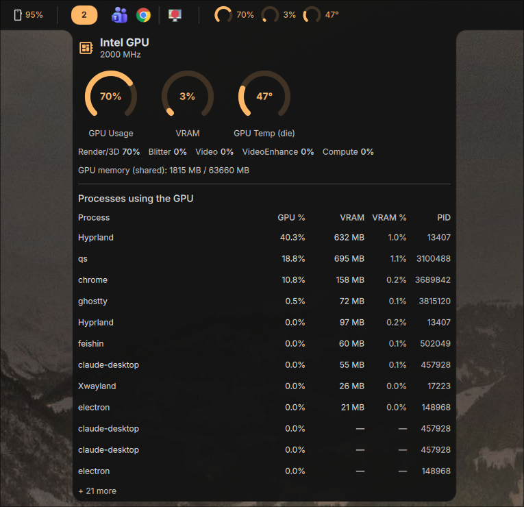

# Intel GPU Monitor — DankMaterialShell plugin

A dank bar widget that monitors an Intel GPU (integrated or discrete Arc). It shows
GPU usage, temperature and (optionally) VRAM with your choice of chart, and opens a
detail view listing the processes using the GPU — similar in spirit to
[System Monitor Plus](https://github.com/Dadangdut33/dms-plugins).



## No setup required

Everything is read from the kernel — **no installation, no root, no special
permissions**, and reading the counters does **not wake the GPU**:

- **GPU usage %** and the **per-process list** come from DRM **`fdinfo`** — the
  per-process GPU engine counters (`drm-engine-*`) that `intel_gpu_top`/`nvtop` use.
  A single `awk` pass over `/proc/*/fdinfo/*`, filtered to the Intel driver
  (`i915`/`xe`) so a discrete NVIDIA/AMD GPU is never counted, gives the busiest
  engine's real busy % (render, blitter, video, video-enhance, compute).
- **VRAM** comes from the same scan (`drm-resident-*`): shared system memory on
  iGPUs, dedicated (local) memory on discrete Arc.
- **Temperature** comes from the GPU's hwmon sensor if present (discrete cards), else
  the CPU package/die temperature (integrated GPUs have no separate sensor — shown as
  *GPU Temp (die)*). **Frequency** comes from sysfs. Both are read with Quickshell
  `FileView` (no process spawned).

`intel_gpu_top` is **optional** — only used for the "open in terminal" action, if you
enable it. It is not needed for the widget.

## Installation

```sh
git clone https://github.com/rdannenbring/dms-intel-gpu-plugin ~/.config/DankMaterialShell/plugins/intelGpuMonitor
```

Then enable **Intel GPU Monitor** in DMS Settings → Plugins and add it to a bar.

## Features

- **GPU usage %** in the bar (toggle), with a chart (toggle) — chart type: bar, gauge, donut, pie or thermometer. Charts are GPU-drawn (`QtQuick.Shapes` / rectangles, no CPU `Canvas`); *bar* is the lightest.
- **Temperature** value in the bar (toggle), with a chart (toggle) — same chart types, configurable °C range.
- **VRAM %** in the bar (toggle) — off by default; see the note below.
- Per-status **icons** (toggle) with a **custom icon** picker for each.
- Configurable **mouse actions** (left / right / middle), each: detail view, menu, open in terminal, or nothing. Defaults: left = detail, right = menu, middle = nothing.
- **Open intel_gpu_top in a terminal** — defaults to your `$TERMINAL`; the run flag is chosen automatically for known terminals.
- **Detail view**: large charts for the enabled metrics, a per-engine breakdown, and a table of processes using the GPU — Process, GPU %, VRAM (MB), VRAM %, PID.

## Performance

The metrics refresh on an interval (**Refresh interval**, default 2 s). Each refresh
is one `awk` scan of `/proc` (~100  ms of mostly disk-cache I/O, off the render
thread) plus a couple of tiny sysfs reads. It pauses while the bar is hidden. If your
GPU has little headroom, raise the interval (e.g. 5000 ms) and prefer the *bar* chart
type or numbers only.

## VRAM notes

- VRAM comes from the same `fdinfo` scan as usage — **no extra cost**.
- **Integrated GPUs** report shared system memory, so the percentage is of system
  RAM and reads low; the used-MB figure is the real GPU-resident memory.
- **Discrete Intel Arc GPUs** report dedicated (local) memory. Set your card's VRAM in
  **Total VRAM override (MB)** (e.g. `8192` for an 8 GB A770) so the percentage is
  meaningful. ⚠️ Discrete-Arc handling is implemented but **untested** — the developer
  has no Arc card. Feedback welcome.

## Settings overview

- **General**: refresh interval.
- **GPU Usage / Temperature / VRAM**: show value, show chart (+ chart type), show icon (+ custom icon), plus per-metric extras (temperature source GPU & range, VRAM override).
- **Interaction**: left / right / middle click actions, terminal launcher toggle and terminal command.

## Backlog

- Per-value **thresholds** to drive icon changes, color changes and alert messages.

## License

MIT — see [LICENSE](LICENSE).
